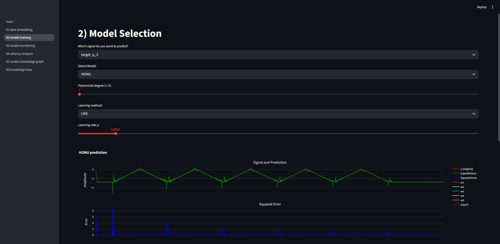
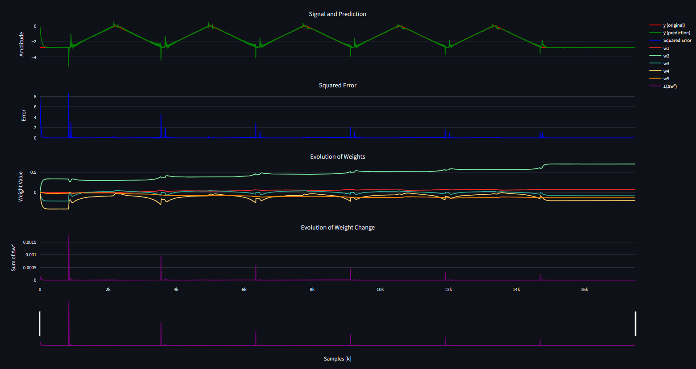

## Ukázky běžící aplikace

### Obrázek 1 – Přehled pipeline aplikace

Zobrazení kompletní workflow aplikace Adaptive Algorithms & Applications. Pipeline zahrnuje načtení a embedding dat, výběr a trénování adaptivního modelu, monitoring chování modelu, saliency analýzu, detekci režimů a ukládání výsledků do knowledge base.

---

### Obrázek 2 – Konfigurace adaptivního modelu

Ukázka konfigurace modelu v aplikaci: volba cílového signálu, typu modelu (HONU), stupně polynomu a metody učení (LMS) včetně nastavení learning rate. Tato část umožňuje řízené experimentování s parametry adaptivního učení.

---

### Obrázek 3 – Výsledky adaptivní predikce a monitoringu

Výstupy adaptivního učení zobrazující porovnání skutečného signálu a predikce, průběh kvadratické chyby, vývoj vah modelu a změny vah v čase. Grafy dokumentují schopnost modelu reagovat na změny dynamiky signálu.

---